# 🏥 MediConnect Pro

## Revolutionizing Healthcare Management

Built with passion , MediConnect Pro is a cutting-edge healthcare platform that bridges the gap between patients and healthcare providers. Using the power of MERN stack technology, this platform delivers a seamless experience for everyone involved in the healthcare journey.

## 🌟 Experience It Live

👉 [https://sahil-frontend-kappa.vercel.app](https://hms-frontend-kappa.vercel.app/)  
🔐 [https://sahil-nine.vercel.app/](https://hms-admin-nine.vercel.app/)

## 💫 Key Innovations

### For Patients
- Smart doctor search by specialization
- Real-time appointment booking
- Secure payment integration
- Digital medical history tracking
- Personalized health dashboard

### For Healthcare Providers
- Intelligent appointment management
- Revenue analytics dashboard
- Patient interaction history
- Profile customization
- Automated scheduling system

### For Administrators
- Comprehensive system oversight
- Real-time analytics dashboard
- Staff management tools
- Resource allocation
- Performance metrics

## 🛠️ Technical Excellence

## Here are some references images

## User Sction

### User Registration & Login

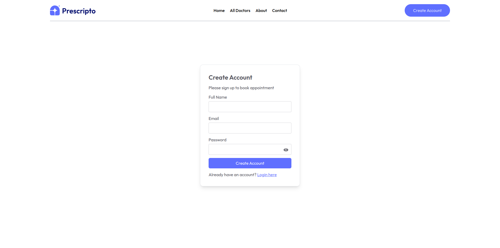

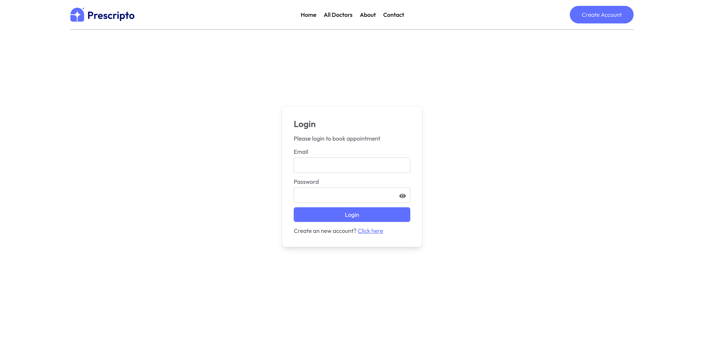

### Home Screen

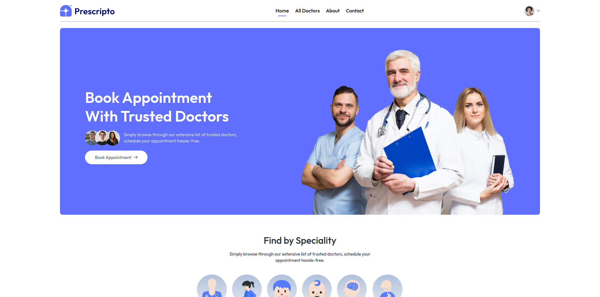

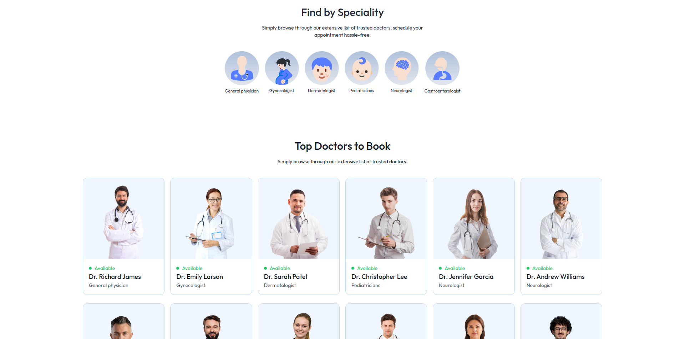

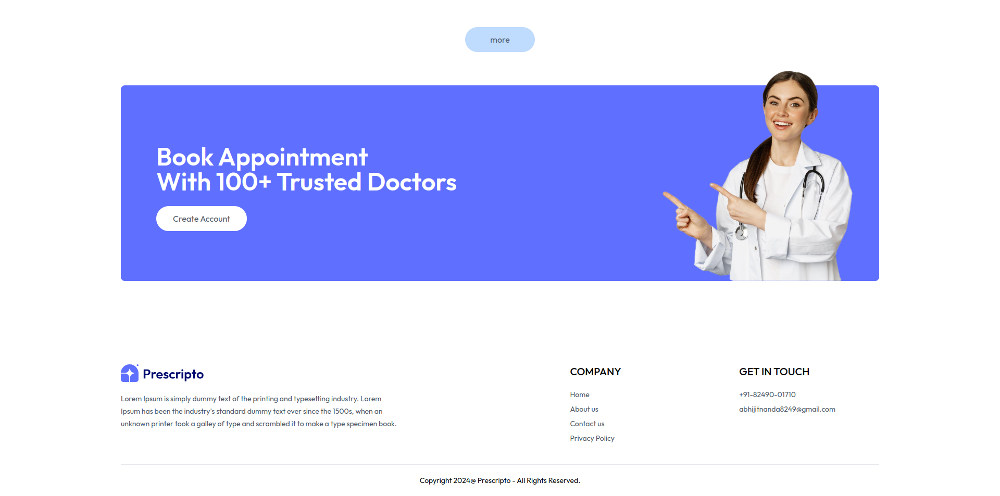

### All Doctors Page

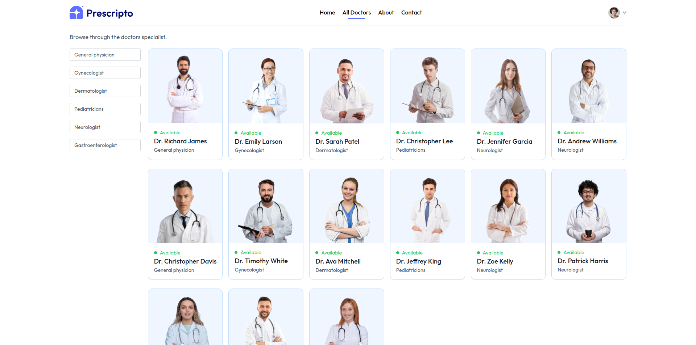

### About Us

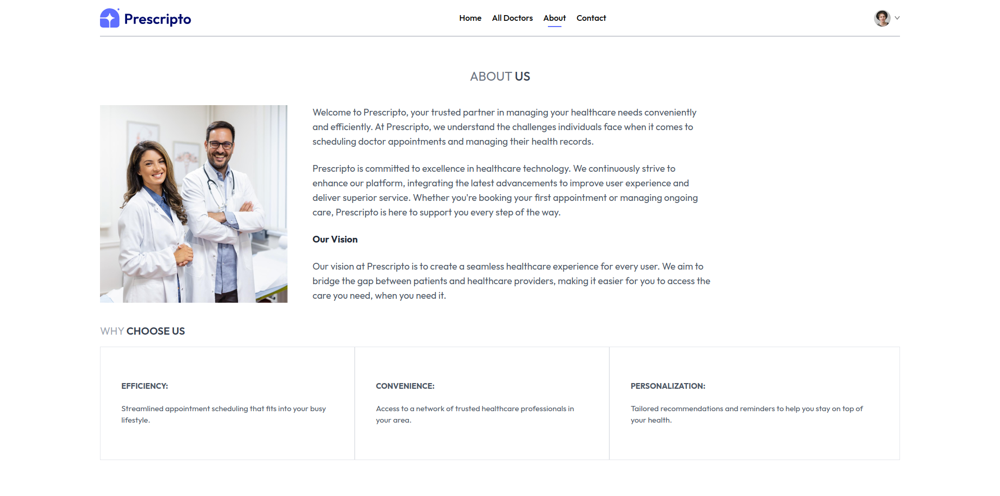

### Contact Information

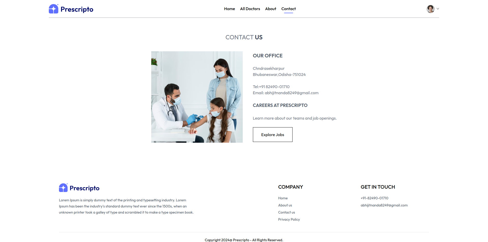

## Admin Section

### Admin Login


### Admin Dashboard

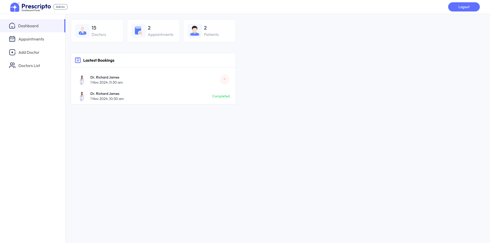

### All Appointments

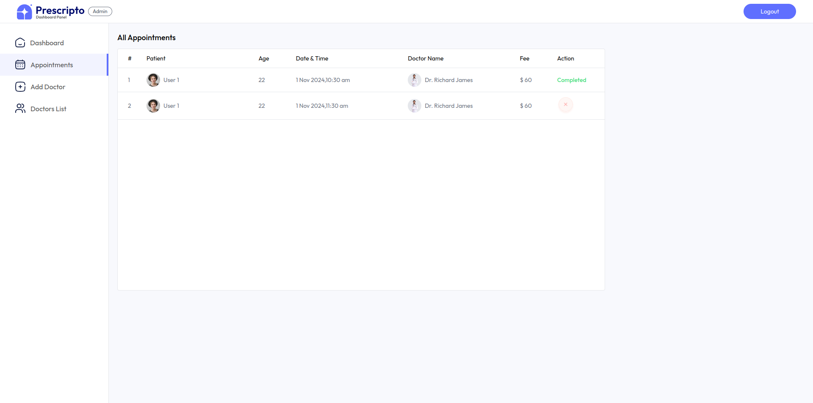

### Add Doctor Form

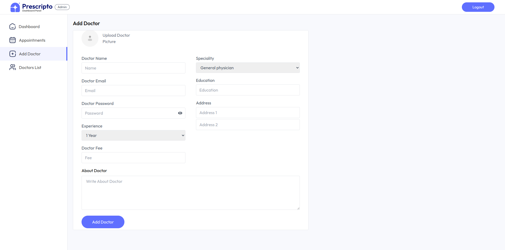

### All Doctor

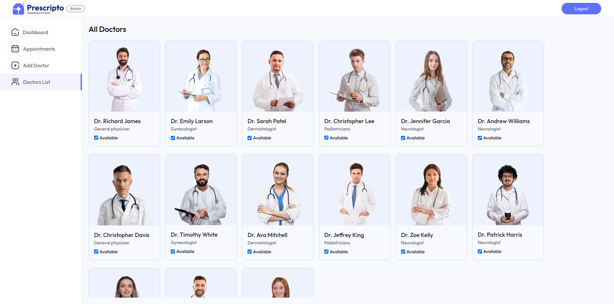

## Doctor Section

### Doctor Login

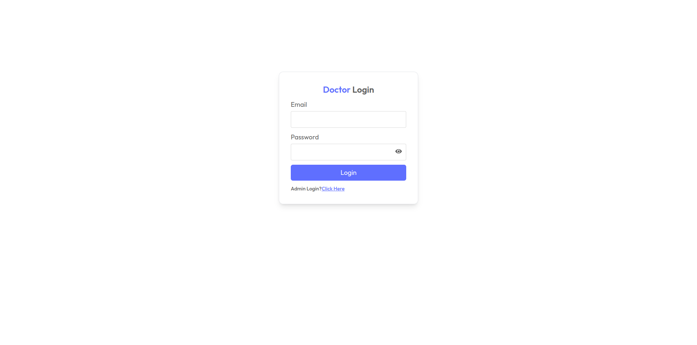

### Doctor Dashboard

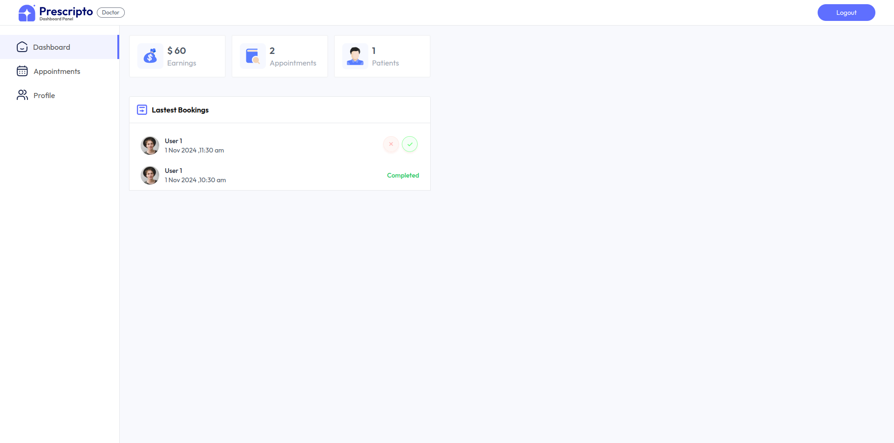

### Doctor Appointments

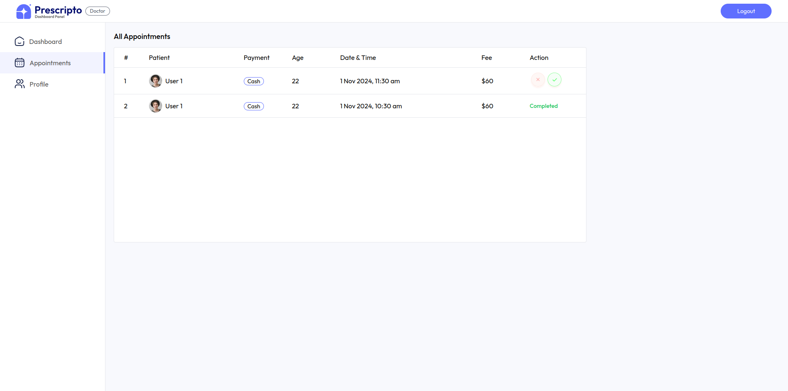

### Doctor Profile

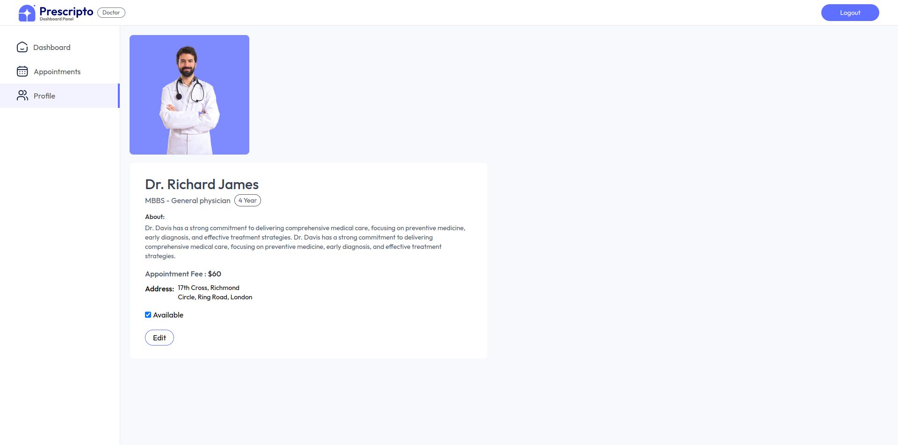

### Thank You for Visiting 🎊 🎉 🙏
# Doctor Management System

A modern web application for managing doctors, patients, and appointments. Built with React (Vite), Node.js, Express, and MongoDB.

## Live Demo

[Live Link (sahil)](https://hms-frontend.vercel.app)

## Features
- Admin and Doctor dashboards
- Patient management
- Appointment scheduling
- Authentication and authorization
- Responsive UI with Tailwind CSS
- Cloudinary integration for image uploads

## 🔧 Built with Modern Tech

- 🎨 **Frontend Magic:**
  - React + Vite for lightning-fast performance
  - Tailwind CSS for stunning aesthetics
  - Responsive design for all devices

- 🖥️ **Backend Power:**
  - Node.js & Express for robust server logic
  - MongoDB for flexible data management
  - JWT for secure authentication

- ⚡ **Special Features:**
  - Cloudinary for seamless image management
  - Razorpay integration for secure payments
  - Real-time updates with WebSocket

## 🚀 Quick Start

1. **Clone & Install:**
   ```bash
   git clone https://github.com/sahil-saroj/hms.git
   cd doctor-management
   ```

2. **Set Up Dependencies:**
   ```bash
   # Install all dependencies at once
   npm run setup-all
   ```

3. **Configure:**
   - Create `.env` files following `.env.example`
   - Set up MongoDB & Cloudinary credentials

4. **Launch:**
   ```bash
   # Start all services
   npm run dev
   ```

## 📱 Smart Architecture
```
MediConnect/
├── 🏥 admin/      # Medical staff portal
├── ⚕️ backend/    # API & business logic
└── 🌐 frontend/   # Patient interface
```

## 🎨 Developer

Crafted with ❤️ by **Sahil Saroj**


---

*Empowering healthcare through technology*
